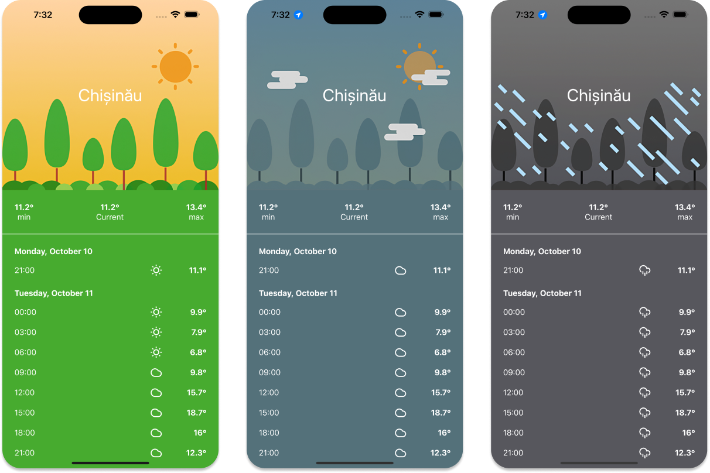

# WeatherApp

 

A weather forecast application developed using `SwiftUI` and `TCA`.

## Features:
- Fetch the current weather details at user coordinates;
- Fetch the 3-hour interval forecast for the next 5 days;
- Adjust design based on weather conditions;
- Fully unit tested;

## Packages:
|Name|Description|
|-|-|
|`Networking`|Responsible for handling all HTTP requests|
|`WeatherService`|Uses the `Networking` package to fetch the weather from `OpenWeather API`|
|`Resources`|Contains all the shared assets/colors/fonts.|
|`Forecast`|Contains the `ForecastView`, which uses the `WeatherService` package to display the current weather and a 5-day forecast at the user's location.|

## Dependencies:
|Name|Description|
|-|-|
|[ComposableArchitecture](https://github.com/pointfreeco/swift-composable-architecture)|Handles the boilerplate code for creating the composable components.|
|[ComposableCoreLocation](https://github.com/pointfreeco/composable-core-location)|A wrapper on `CLLocationManager`, which allows us to handle location events as actions inside our reducer.|

## Tools:
|Name|Description|
|-|-|
|[Slather](https://github.com/SlatherOrg/slather)|Generates code coverage reports.|
